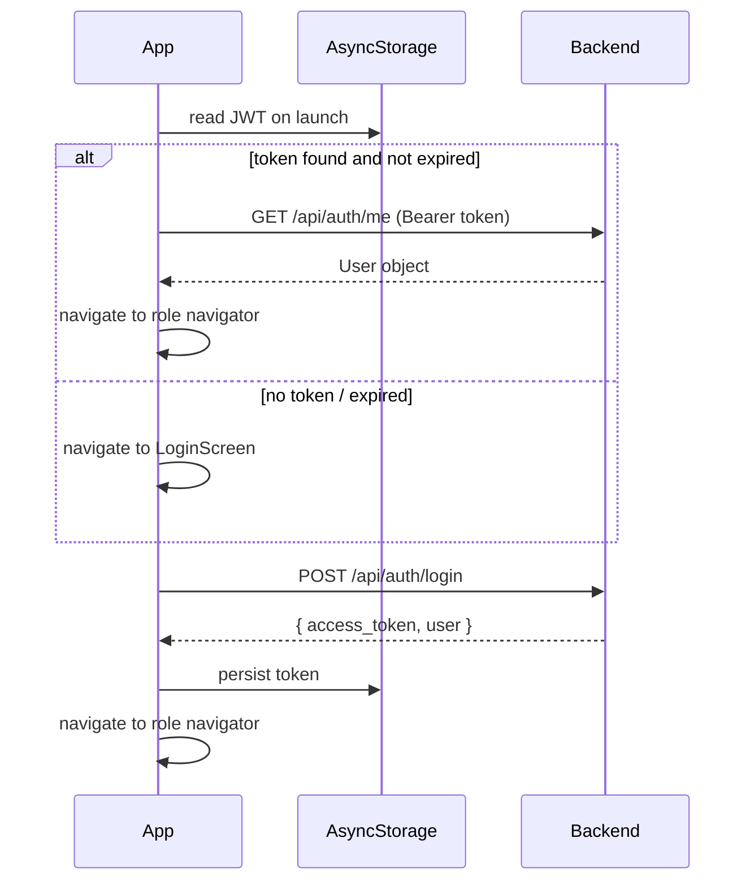
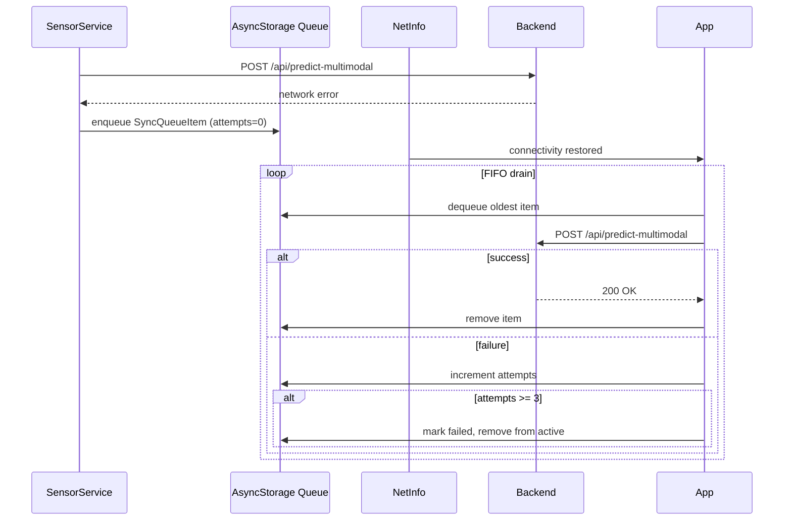

# Design Document — RoadGuard-AI

## Overview

RoadGuard-AI is a production-grade Android mobile application for intelligent road hazard detection,
real-time mapping, AI-assisted driving advice, and admin analytics. The system is composed of two
primary tiers:

- **Mobile client** — Expo React Native (TypeScript), targeting Android via EAS Build.
- **Backend server** — FastAPI (Python), running on a local WiFi network, backed by SQLite via
  SQLAlchemy ORM.

The mobile app communicates with the backend over HTTP/REST. All protected endpoints require a JWT
Bearer token. The backend hosts the AI inference pipeline (TensorFlow CNN + YOLOv8), the Claude
chat proxy, the Whisper voice transcription proxy, and the admin reporting engine.

### Key Design Decisions

- **Local network deployment**: Backend runs on the same WiFi as the phone. The base URL is
  configurable in `constants.ts` so the app can be pointed at any host without a rebuild.
- **Singleton model loading**: TensorFlow and YOLO models are loaded once at FastAPI startup and
  reused across requests to avoid per-request latency.
- **Offline-first sensor pipeline**: Spike detections are queued locally when the backend is
  unreachable and synced in FIFO order when connectivity returns.
- **Zustand for state management**: Lightweight, TypeScript-native, no boilerplate compared to Redux.
- **JWT-only auth**: Stateless; no server-side session store required for the local-network use case.

---

## Architecture

```mermaid
graph TD
    subgraph Mobile [Expo React Native — Android]
        Nav[AppNavigator]
        Auth[AuthNavigator]
        User[UserNavigator]
        Admin[AdminNavigator]
        SS[SensorService]
        CS[ClaudeService]
        VS[VoiceService]
        WS[WeatherService]
        Sync[SyncQueue / AsyncStorage]
        Stores[Zustand Stores]
    end

    subgraph Backend [FastAPI — Local Network :8000]
        AuthAPI[/api/auth]
        PredAPI[/api/predict-multimodal]
        EventsAPI[/api/events]
        ChatAPI[/api/chat]
        VoiceAPI[/api/voice/transcribe]
        AdminAPI[/api/admin/*]
        PushAPI[/api/users/push-token]
        FP[Fusion Pipeline]
        TF[TensorFlow CNN]
        YOLO[YOLOv8]
        DB[(SQLite)]
    end

    subgraph External
        Claude[Anthropic Claude API]
        Whisper[OpenAI Whisper API]
        OWM[OpenWeatherMap API]
        GMaps[Google Maps Directions API]
        ExpoPush[Expo Push API]
    end

    Nav --> Auth & User & Admin
    SS --> Sync
    SS --> PredAPI
    Sync -->|retry on reconnect| PredAPI
    CS --> ChatAPI
    VS --> VoiceAPI
    WS --> OWM
    User --> SS & CS & VS & WS
    Admin --> AdminAPI

    PredAPI --> FP --> TF & YOLO --> DB
    ChatAPI --> Claude
    VoiceAPI --> Whisper
    AdminAPI --> DB
    AuthAPI --> DB
    EventsAPI --> DB
    PushAPI --> DB
    AdminAPI -->|broadcast| ExpoPush
```

---

## Components and Interfaces

### Navigation Structure

```
AppNavigator (root stack)
├── AuthNavigator (stack) — shown when unauthenticated
│   ├── SplashScreen
│   ├── LoginScreen
│   └── SignupScreen
├── UserNavigator (bottom tabs) — role = "user"
│   ├── HomeScreen
│   ├── LiveMapScreen
│   ├── MonitorScreen
│   ├── AssistantScreen
│   └── ProfileScreen
│       └── SettingsPanel (inline)
└── AdminNavigator (bottom tabs) — role = "admin"
    ├── AdminDashboardScreen
    ├── AdminMapScreen
    ├── AdminUsersScreen
    ├── AdminAnalyticsScreen
    └── AdminReportsScreen
```

### Mobile Services

#### SensorService

Manages the accelerometer state machine and spike detection pipeline.

```typescript
type SensorState =
  | "IDLE"
  | "INITIALIZING"
  | "COLLECTING"
  | "SPIKE_DETECTED"
  | "TRANSMITTING"
  | "ERROR";

interface SensorService {
  state: SensorState;
  start(): void;
  stop(): void;
  onSpike(handler: (payload: SpikePayload) => void): void;
}

interface SpikePayload {
  sensor_data: number[][];   // 100×3 accelerometer window
  latitude: number;
  longitude: number;
  timestamp: string;         // ISO 8601
}
```

State transitions:
```
IDLE → INITIALIZING (start called)
INITIALIZING → COLLECTING (sensor subscription ready)
COLLECTING → SPIKE_DETECTED (SMA > 2.5× running mean)
SPIKE_DETECTED → TRANSMITTING (payload dispatched)
TRANSMITTING → COLLECTING (response received)
TRANSMITTING → COLLECTING (queued offline)
* → ERROR (unrecoverable sensor failure)
ERROR → IDLE (reset called)
```

#### ClaudeService

```typescript
interface ClaudeService {
  sendMessage(text: string, context: ChatContext): Promise<string>;
}

interface ChatContext {
  recentHazards: HazardEvent[];   // last 10
  weather: WeatherSnapshot;
}
```

#### VoiceService

```typescript
interface VoiceService {
  startRecording(): Promise<void>;
  stopAndTranscribe(): Promise<string>;  // returns transcribed text
  speak(text: string, rate?: number): void;
}
```

#### WeatherService

```typescript
interface WeatherService {
  fetchConditions(lat: number, lon: number): Promise<WeatherSnapshot>;
  computeSafetyScore(condition: WeatherCondition): number;
}

type WeatherCondition = "Clear" | "Cloudy" | "LightRain" | "HeavyRain" | "Fog" | "Storm";
```

### Backend Modules

| Module | Responsibility |
|---|---|
| `auth.py` | JWT creation/validation, bcrypt hashing, /api/auth/* routes |
| `fusion.py` | Multimodal prediction pipeline, singleton model loader |
| `events.py` | Hazard event CRUD, /api/events routes |
| `chat.py` | Claude API proxy, /api/chat route |
| `voice.py` | Whisper API proxy, /api/voice/transcribe route |
| `admin.py` | User management, stats, CSV/PDF export, /api/admin/* routes |
| `notifications.py` | Push token storage, Expo Push broadcast |
| `models.py` | SQLAlchemy ORM models |
| `config.py` | Environment variable loading |

---

## Data Models

### SQLAlchemy ORM (Backend)

```python
class User(Base):
    __tablename__ = "users"
    id: int (PK, autoincrement)
    email: str (unique, indexed)
    username: str (unique, indexed)
    hashed_password: str
    role: str  # "user" | "admin"
    is_active: bool = True
    is_banned: bool = False
    created_at: datetime
    last_login: datetime | None

class HazardEvent(Base):
    __tablename__ = "hazard_events"
    id: int (PK, autoincrement)
    label: int          # 0=Normal, 1=SpeedBreaker, 2=Pothole
    label_name: str
    confidence: float
    p_sensor: float     # CNN probability
    p_vision: float     # YOLO probability
    latitude: float
    longitude: float
    timestamp: datetime
    user_id: int | None (FK → users.id)

class PushToken(Base):
    __tablename__ = "push_tokens"
    id: int (PK, autoincrement)
    user_id: int (FK → users.id)
    token: str (unique)
    created_at: datetime
```

### TypeScript Types (Mobile)

```typescript
interface HazardEvent {
  id: number;
  label: 0 | 1 | 2;
  label_name: "Normal" | "SpeedBreaker" | "Pothole";
  confidence: number;
  p_sensor: number;
  p_vision: number;
  latitude: number;
  longitude: number;
  timestamp: string;  // ISO 8601
}

interface SyncQueueItem {
  id: string;           // uuid
  payload: SpikePayload;
  attempts: number;     // max 3
  created_at: string;
  status: "pending" | "failed";
}

interface WeatherCache {
  condition: WeatherCondition;
  temperature: number;
  humidity: number;
  wind_speed: number;
  forecast: ForecastEntry[];
  fetched_at: string;
  location: { lat: number; lon: number };
}

interface User {
  id: number;
  email: string;
  username: string;
  role: "user" | "admin";
  is_active: boolean;
  created_at: string;
}
```

---

## Backend API Design

### Authentication

| Method | Path | Auth | Description |
|---|---|---|---|
| POST | /api/auth/signup | None | Create user, return JWT |
| POST | /api/auth/login | None | Verify credentials, return JWT |
| GET | /api/auth/me | JWT | Return current user profile |

**POST /api/auth/signup**
```json
// Request
{ "email": "string", "username": "string", "password": "string" }
// Response 200
{ "access_token": "string", "token_type": "bearer", "user": { ...User } }
// Response 409
{ "detail": "Email already registered" }
```

**POST /api/auth/login**
```json
// Request
{ "email": "string", "password": "string" }
// Response 200
{ "access_token": "string", "token_type": "bearer", "user": { ...User } }
// Response 401
{ "detail": "Invalid credentials" }
// Response 403
{ "detail": "Account suspended" }
```

### Prediction

| Method | Path | Auth | Description |
|---|---|---|---|
| POST | /api/predict-multimodal | JWT | Run fusion pipeline |
| GET | /api/events | JWT | List hazard events |

**POST /api/predict-multimodal**
```json
// Request
{
  "sensor_data": [[x,y,z], ...],  // 100×3
  "latitude": 3.1390,
  "longitude": 101.6869,
  "timestamp": "2024-01-15T10:30:00Z"
}
// Response 200
{
  "label": 2,
  "label_name": "Pothole",
  "confidence": 0.87,
  "p_sensor": 0.91,
  "p_vision": 0.80
}
// Response 422
{ "detail": "Invalid sensor data: contains NaN or Inf" }
```

**GET /api/events**
```
Query params: label (int), start_date (ISO), end_date (ISO), limit (int, default 100)
Response 200: HazardEvent[]
```

### Chat and Voice

| Method | Path | Auth | Description |
|---|---|---|---|
| POST | /api/chat | JWT | Proxy to Claude API |
| POST | /api/voice/transcribe | JWT | Proxy to Whisper API |

**POST /api/chat**
```json
// Request
{
  "message": "string",
  "context": {
    "recent_hazards": [ ...HazardEvent[] ],
    "weather": { ...WeatherSnapshot }
  }
}
// Response 200
{ "response": "string" }
```

**POST /api/voice/transcribe**
```
Content-Type: multipart/form-data
Body: audio file (m4a/wav)
Response 200: { "text": "string" }
```

### Push Notifications

| Method | Path | Auth | Description |
|---|---|---|---|
| POST | /api/users/push-token | JWT | Register push token |
| POST | /api/admin/broadcast | Admin JWT | Send push to all tokens |

### Admin

| Method | Path | Auth | Description |
|---|---|---|---|
| GET | /api/admin/users | Admin JWT | List all users |
| PUT | /api/admin/users/{id}/ban | Admin JWT | Ban user |
| PUT | /api/admin/users/{id}/unban | Admin JWT | Unban user |
| GET | /api/admin/stats | Admin JWT | KPI statistics |
| GET | /api/admin/export/csv | Admin JWT | Download CSV |
| GET | /api/admin/export/pdf | Admin JWT | Download PDF |

**GET /api/admin/stats**
```json
{
  "total_events": 1240,
  "events_last_24h": 38,
  "total_users": 95,
  "active_users_7d": 42,
  "events_by_label": { "0": 800, "1": 280, "2": 160 },
  "events_by_day": [ { "date": "2024-01-15", "count": 38 }, ... ],
  "events_by_hour": [ { "hour": 0, "count": 5 }, ... ]
}
```

---

## Sensor Fusion Pipeline

### SMA and Spike Detection (Mobile)

```
magnitude = sqrt(x² + y² + z²)
sma[i] = mean(magnitude[i-9 : i+1])          // window = 10
running_mean = mean(sma_buffer)               // growing buffer
spike = sma[i] > 2.5 × running_mean
```

When a spike is detected:
1. Capture the last 100 raw samples (100×3 array).
2. Read current GPS coordinates.
3. Transition to SPIKE_DETECTED → TRANSMITTING.
4. POST to `/api/predict-multimodal`.
5. On success → store HazardEvent, transition to COLLECTING.
6. On network failure → enqueue SyncQueueItem, transition to COLLECTING.

### Weighted Fusion (Backend)

```python
# sensor_probs: shape (3,) from TF CNN softmax
# vision_probs: shape (3,) from YOLOv8 classification softmax
fused = 0.6 * sensor_probs + 0.4 * vision_probs
label = int(argmax(fused))
confidence = float(fused[label])
```

The vision branch is optional — if no image is provided, the backend falls back to sensor-only
prediction with `confidence = float(sensor_probs[argmax(sensor_probs)])`.

---

## State Management (Zustand)

```typescript
// authStore
interface AuthStore {
  user: User | null;
  token: string | null;
  login(token: string, user: User): void;
  logout(): void;
}

// hazardStore
interface HazardStore {
  events: HazardEvent[];
  setEvents(events: HazardEvent[]): void;
  addEvent(event: HazardEvent): void;
}

// sensorStore
interface SensorStore {
  state: SensorState;
  magnitudeBuffer: number[];   // last 200 samples for chart
  syncQueueCount: number;
  setState(s: SensorState): void;
  pushMagnitude(v: number): void;
  setSyncCount(n: number): void;
}

// settingsStore
interface SettingsStore {
  spikeThreshold: number;      // default 2.5
  alertRadius: number;         // default 500 m
  mapStyle: "dark" | "satellite" | "standard";
  speechRate: number;          // default 1.0
  proximityAlertsEnabled: boolean;
  update(partial: Partial<SettingsStore>): void;
}
```

All stores are persisted to AsyncStorage via `zustand/middleware` `persist`.

---

## Authentication Flow



- Tokens are HS256 JWTs signed with `JWT_SECRET`, expiry = 7 days.
- `python-jose[cryptography]` handles signing/verification on the backend.
- Passwords are hashed with `bcrypt` (cost factor 12).
- Every protected route uses a FastAPI `Depends(get_current_user)` dependency that validates the
  Bearer token and injects the User object.
- Admin routes additionally use `Depends(require_admin)` which checks `user.role == "admin"`.

---

## AI Chatbot Design

### Text Flow

```
User types message
  → AssistantScreen collects last 10 HazardEvents + WeatherCache
  → POST /api/chat { message, context }
  → Backend builds system prompt:
      "You are RoadGuard-AI, a road safety assistant.
       Recent hazards: <serialized events>
       Current weather: <condition>, safety score: <score>"
  → Backend calls Anthropic Claude API (claude-3-haiku)
  → Response streamed back to mobile
  → Displayed as chat bubble
  → Expo Speech TTS reads response aloud (if enabled)
```

### Voice Flow

```
User taps mic button
  → expo-av starts recording (m4a)
  → User taps stop
  → POST /api/voice/transcribe (multipart audio)
  → Backend calls OpenAI Whisper API
  → Transcribed text returned
  → Text populated in chat input
  → User sends (same text flow as above)
```

### Suggested Prompts

Pre-defined chips rendered in the AssistantScreen:
- "What hazards are near me?"
- "Is it safe to drive now?"
- "Show me the worst roads today"
- "What does a pothole detection mean?"

---

## Map Design

### LiveMapScreen

- `react-native-maps` MapView with `customMapStyle` (dark JSON style).
- Markers colored per hazard type (Req 4.4).
- `react-native-map-clustering` clusters markers when >5 overlap within 50 dp.
- Heatmap overlay via `react-native-maps` `Heatmap` component, toggled by a FAB.
- Bottom sheet (via `@gorhom/bottom-sheet`) for marker detail and filter panel.
- `setInterval` refresh every 30 seconds while screen is focused.
- Filter state (label, date range) held in local component state; filtered events derived from
  `hazardStore.events`.

### AdminMapScreen

Same base as LiveMapScreen but shows all events without user-scoped filtering, and includes a
density heatmap always-on.

---

## Offline Sync



- Queue is a JSON array in AsyncStorage under key `@roadguard/sync_queue`.
- Max 500 items; oldest discarded when limit reached.
- `sensorStore.syncQueueCount` reflects current queue length for UI indicator.
- `@react-native-community/netinfo` `addEventListener` triggers drain on reconnect.

---

## Notification System

### Push Token Registration

On app launch (after auth), the app calls `Notifications.getExpoPushTokenAsync()` and POSTs the
token to `/api/users/push-token`. Tokens are stored in the `push_tokens` table.

### Proximity Background Task

```typescript
TaskManager.defineTask(PROXIMITY_TASK, async () => {
  const location = await Location.getCurrentPositionAsync();
  const hazards = await getHazardsFromStore();
  const radius = settingsStore.alertRadius;
  for (const h of hazards) {
    if (h.confidence >= 0.7 && distance(location, h) <= radius) {
      await Notifications.scheduleNotificationAsync({ ... });
    }
  }
});

// Registered with 30s minimum interval
Location.startLocationUpdatesAsync(PROXIMITY_TASK, { timeInterval: 30000 });
```

### Admin Broadcast

`POST /api/admin/broadcast { title, body }` → backend iterates all `push_tokens` records and calls
the Expo Push API in batches of 100.

---

## Admin Portal Design

### AdminDashboardScreen

- 4 KPI cards (total events, 24h events, total users, 7d active users) fetched from
  `GET /api/admin/stats`.
- Live feed: `FlatList` of 20 most recent events, auto-refreshed every 15 seconds.
- System health row: backend ping, model status (from `/api/health`), DB record count.
- "Backend Offline" banner rendered when fetch fails.

### AdminAnalyticsScreen

| Chart | Library | Data source |
|---|---|---|
| Line chart (daily events × 30d) | `react-native-chart-kit` LineChart | `events_by_day` |
| Bar chart (events by hour) | `react-native-chart-kit` BarChart | `events_by_hour` |
| Pie chart (label distribution) | `react-native-chart-kit` PieChart | `events_by_label` |
| Calendar heatmap | `react-native-calendars` | `events_by_day` |

### AdminReportsScreen

- Lists generated report files from device filesystem (`expo-file-system`).
- "Generate CSV" → calls `GET /api/admin/export/csv`, saves to `FileSystem.documentDirectory`.
- "Generate PDF" → calls `GET /api/admin/export/pdf`, saves to `FileSystem.documentDirectory`.
- Share button invokes `expo-sharing` with the saved file URI.

### PDF Generation (Backend)

`reportlab` generates a PDF with:
1. Title page: "RoadGuard-AI Hazard Report", generation timestamp, total record count.
2. Summary statistics table: total events, breakdown by label, date range.
3. Top-10 hazard locations table: lat/lon, label, confidence, timestamp.

---

## EAS Build Configuration

```json
// eas.json
{
  "build": {
    "development": {
      "distribution": "internal",
      "android": { "buildType": "apk", "gradleCommand": ":app:assembleDebug" }
    },
    "preview": {
      "android": { "buildType": "apk" }
    },
    "production": {
      "android": { "buildType": "app-bundle" }
    }
  }
}
```

Android permissions declared in `app.json`:
```
ACCESS_FINE_LOCATION, ACCESS_COARSE_LOCATION, ACCESS_BACKGROUND_LOCATION,
CAMERA, RECORD_AUDIO, VIBRATE, RECEIVE_BOOT_COMPLETED
```

---

## Security Considerations

- **No API keys in the mobile bundle**: OpenWeatherMap, Google Maps, Anthropic, and OpenAI keys
  live only in the backend `config.py` (loaded from environment variables). The mobile app only
  holds the backend base URL.
- **JWT validation middleware**: Every protected FastAPI route uses `Depends(get_current_user)`.
  The dependency decodes and verifies the HS256 signature; expired or tampered tokens return 401.
- **Admin role guard**: `Depends(require_admin)` checks `user.role == "admin"` after token
  validation. A valid user JWT cannot access admin endpoints.
- **bcrypt password hashing**: Cost factor 12. Plaintext passwords are never stored or logged.
- **Input validation**: Pydantic models on all request bodies. Sensor data validated for NaN/Inf
  before inference.
- **CORS**: FastAPI `CORSMiddleware` restricted to the local network subnet in production config.

---

## Performance Considerations

- **Singleton model loading**: `fusion.py` loads TF and YOLO models in a `@app.on_event("startup")`
  handler. A module-level dict `_models` holds references. Requests call `get_models()` which
  returns the cached dict.
- **100 Hz sampling, 10 Hz UI updates**: `SensorService` samples at 100 Hz internally. The
  `sensorStore.magnitudeBuffer` is updated at 10 Hz via a throttle wrapper to avoid React re-render
  storms.
- **Marker clustering threshold**: `react-native-map-clustering` `radius` prop set to 50 (dp).
  Clusters form when ≥5 markers overlap. This keeps the map readable at city-scale zoom.
- **Pagination**: `GET /api/events` defaults to `limit=100`. The Hazard History screen uses
  cursor-based pagination (offset param) to avoid loading the full dataset.
- **Weather caching**: `WeatherCache` is stored in AsyncStorage with a 10-minute TTL. Subsequent
  requests within the TTL return the cached value without a network call.

---

## Correctness Properties

*A property is a characteristic or behavior that should hold true across all valid executions of a system — essentially, a formal statement about what the system should do. Properties serve as the bridge between human-readable specifications and machine-verifiable correctness guarantees.*

### Property 1: JWT signup round-trip

*For any* valid (email, username, password) triple, calling POST /api/auth/signup should return a JWT that decodes to a user with role "user", is_active=true, and an expiry approximately 7 days in the future (within a 60-second tolerance).

**Validates: Requirements 1.1**

---

### Property 2: Login returns valid JWT for registered user

*For any* registered user with a known plaintext password, calling POST /api/auth/login should return a JWT that decodes to the same user id and email, with expiry ~7 days out.

**Validates: Requirements 1.2**

---

### Property 3: Duplicate registration is rejected

*For any* user already present in the database, attempting to register again with the same email or the same username should return HTTP 409.

**Validates: Requirements 1.3**

---

### Property 4: Invalid credentials are rejected

*For any* (email, password) pair where either the email does not exist or the password does not match the stored hash, POST /api/auth/login should return HTTP 401 with body `{"detail": "Invalid credentials"}`.

**Validates: Requirements 1.4**

---

### Property 5: Protected endpoints reject missing or invalid tokens

*For any* protected API endpoint and any request that omits the Authorization header or supplies a malformed/expired JWT, the response should be HTTP 401.

**Validates: Requirements 1.5**

---

### Property 6: Banned users cannot log in

*For any* user with is_banned=true, POST /api/auth/login should return HTTP 403 with body `{"detail": "Account suspended"}`.

**Validates: Requirements 1.6**

---

### Property 7: /api/auth/me returns complete user profile

*For any* authenticated user, GET /api/auth/me should return a JSON object containing exactly the fields: id, email, username, role, is_active, and created_at, with values matching the user's database record.

**Validates: Requirements 1.7**

---

### Property 8: JWT persistence round-trip

*For any* JWT stored to AsyncStorage, reading it back on the next simulated app launch should restore an equivalent authenticated session (same user id, same role) without requiring re-login.

**Validates: Requirements 1.8**

---

### Property 9: Logout clears persisted credentials

*For any* authenticated session, calling logout should result in AsyncStorage containing no JWT and the app navigating to the LoginScreen.

**Validates: Requirements 2.4**

---

### Property 10: Role guard blocks cross-role navigation

*For any* admin-only route and any authenticated user with role "user", programmatic navigation to that route should redirect to the User Home screen.

**Validates: Requirements 2.5**

---

### Property 11: SMA correctness

*For any* sequence of accelerometer magnitude samples of length ≥ 10, the SMA value at position i should equal the arithmetic mean of the 10 samples ending at position i (i.e., samples[i-9..i]).

**Validates: Requirements 5.2**

---

### Property 12: Spike detection threshold invariant

*For any* SMA buffer where the most recent SMA value exceeds 2.5 × mean(buffer), the SensorService should transition to SPIKE_DETECTED state; and for any buffer where the most recent value is ≤ 2.5 × mean(buffer), no spike should be detected.

**Validates: Requirements 5.3**

---

### Property 13: Spike payload contains exactly 100 samples

*For any* spike event, the SpikePayload dispatched to the backend should contain a sensor_data array of exactly 100 rows, each with 3 columns (x, y, z).

**Validates: Requirements 5.4**

---

### Property 14: Offline enqueue on network failure

*For any* spike payload and simulated network failure, the SyncQueueItem should appear in the AsyncStorage queue with attempts=0 and status="pending".

**Validates: Requirements 5.6, 18.1**

---

### Property 15: Fusion weight normalization invariant

*For any* pair of probability vectors (p_sensor, p_vision) each of shape (3,) that sum to 1.0, the fused vector computed as 0.6 × p_sensor + 0.4 × p_vision should also sum to 1.0, and the returned confidence should equal fused[argmax(fused)].

**Validates: Requirements 6.2**

---

### Property 16: Non-Normal predictions are persisted

*For any* prediction where the fused label ≠ 0 (i.e., SpeedBreaker or Pothole), a HazardEvent record should be written to the database with matching label, confidence, latitude, longitude, and timestamp.

**Validates: Requirements 6.3**

---

### Property 17: Invalid sensor data returns 422

*For any* POST /api/predict-multimodal request where sensor_data contains at least one NaN or Inf value, the response should be HTTP 422 with detail "Invalid sensor data: contains NaN or Inf".

**Validates: Requirements 6.4**

---

### Property 18: Model singleton — loaded exactly once

*For any* number of concurrent or sequential requests to /api/predict-multimodal, the TensorFlow and YOLO model loader function should be called exactly once (at startup), not once per request.

**Validates: Requirements 6.5**

---

### Property 19: Events endpoint returns descending timestamp order

*For any* set of HazardEvent records in the database, GET /api/events should return them ordered by timestamp descending (newest first), and every consecutive pair (events[i], events[i+1]) should satisfy events[i].timestamp ≥ events[i+1].timestamp.

**Validates: Requirements 6.6**

---

### Property 20: Chat context always includes 10 most recent hazards and weather

*For any* chat message sent by the user, the request body POSTed to /api/chat should contain a context object with exactly the 10 most recent HazardEvent records (by timestamp) and a non-null weather snapshot.

**Validates: Requirements 8.6**

---

### Property 21: Weather safety score is deterministic and bounded

*For any* WeatherCondition value, computeSafetyScore should return a value in [0, 100] and the same condition should always produce the same score (deterministic pure function).

**Validates: Requirements 9.2**

---

### Property 22: Ban/unban round-trip restores user state

*For any* non-admin user, calling PUT /api/admin/users/{id}/ban followed by PUT /api/admin/users/{id}/unban should result in the user's is_banned field returning to false (its original state).

**Validates: Requirements 14.2, 14.3**

---

### Property 23: Admin accounts cannot be banned

*For any* user with role "admin", calling PUT /api/admin/users/{id}/ban should return HTTP 403 with body `{"detail": "Cannot ban admin accounts"}`.

**Validates: Requirements 14.4**

---

### Property 24: Serialization round-trip — JSON

*For any* valid HazardEvent object, serializing it to JSON and deserializing back should produce an object equal to the original (same field values, same types, no data loss).

**Validates: Requirements 20.1**

---

### Property 25: Serialization round-trip — CSV

*For any* non-empty list of HazardEvent objects, seriali
zing to CSV and parsing back should produce a list of objects with identical field values, and re-serializing that list should produce an identical CSV string (round-trip idempotence). The CSV must include columns: id, timestamp, latitude, longitude, label_name, confidence, p_sensor, p_vision.

**Validates: Requirements 10.3, 10.4, 20.2, 20.3**

---

### Property 26: Sync queue persistence round-trip

*For any* set of SyncQueueItems written to AsyncStorage, deserializing the queue on simulated app restart should recover all items with identical payload, attempts, and status fields.

**Validates: Requirements 18.5, 20.4**

---

### Property 27: Sync queue FIFO ordering

*For any* sequence of enqueued SyncQueueItems, the drain loop should process them in the order they were enqueued (oldest first), and each successfully synced item should be removed before the next is attempted.

**Validates: Requirements 18.2**

---

### Property 28: Sync queue cap at 500 items

*For any* sync queue already containing 500 items, enqueuing one more item should result in the queue still containing exactly 500 items, with the oldest item removed and the new item at the tail.

**Validates: Requirements 18.5**

---

### Property 29: Failed items are retired after 3 attempts

*For any* SyncQueueItem that has failed 3 times, the next sync attempt should mark it as "failed" and remove it from the active queue rather than retrying.

**Validates: Requirements 18.4**

---

### Property 30: Push token registration round-trip

*For any* authenticated user and valid Expo push token, calling POST /api/users/push-token should result in the token being retrievable from the push_tokens table for that user.

**Validates: Requirements 17.1**

---

### Property 31: Proximity alert fires only above confidence threshold

*For any* set of HazardEvents and a user location, the proximity background task should only trigger a local notification for events where confidence ≥ 0.7 AND distance(user, event) ≤ alertRadius.

**Validates: Requirements 17.2**

---

## Error Handling

### Mobile (TypeScript)

| Scenario | Handling |
|---|---|
| Backend unreachable (spike) | Enqueue to SyncQueue; SensorService stays in COLLECTING |
| Backend unreachable (chat) | Display "Assistant unavailable. Please try again." |
| Backend unreachable (map refresh) | Show last cached events; no crash |
| JWT expired on launch | Clear AsyncStorage; navigate to LoginScreen |
| OpenWeatherMap API error | Display cached weather with "Data may be outdated" notice |
| Google Maps Directions API error | Display "Route unavailable. Check your API key and network connection." |
| expo-av recording failure | Show inline error in AssistantScreen; do not crash |
| AsyncStorage read/write failure | Log error; fall back to in-memory state |

### Backend (Python / FastAPI)

| Scenario | HTTP Status | Response |
|---|---|---|
| Duplicate email/username on signup | 409 | `{"detail": "Email already registered"}` |
| Invalid credentials on login | 401 | `{"detail": "Invalid credentials"}` |
| Banned user login | 403 | `{"detail": "Account suspended"}` |
| Missing/invalid JWT | 401 | `{"detail": "Not authenticated"}` |
| User-role accessing admin endpoint | 403 | `{"detail": "Admin access required"}` |
| Admin attempting to ban admin | 403 | `{"detail": "Cannot ban admin accounts"}` |
| NaN/Inf in sensor_data | 422 | `{"detail": "Invalid sensor data: contains NaN or Inf"}` |
| Model inference exception | 500 | `{"detail": "Inference error: <message>"}` |
| Claude API timeout/error | 502 | `{"detail": "Upstream AI service unavailable"}` |
| Whisper API timeout/error | 502 | `{"detail": "Transcription service unavailable"}` |
| Database integrity error | 500 | `{"detail": "Database error"}` |

All unhandled exceptions are caught by a global FastAPI exception handler that logs the traceback
and returns a generic 500 response to avoid leaking stack traces to clients.

---

## Testing Strategy

### Dual Testing Approach

Both unit tests and property-based tests are required. They are complementary:

- **Unit tests** verify specific examples, integration points, and error conditions.
- **Property-based tests** verify universal invariants across randomly generated inputs.

### Property-Based Testing

**Library**: `hypothesis` (Python, backend) and `fast-check` (TypeScript, mobile).

Each property-based test must:
- Run a minimum of **100 iterations** (configured via `@settings(max_examples=100)` in Hypothesis,
  `{ numRuns: 100 }` in fast-check).
- Include a comment tag referencing the design property:
  `# Feature: roadguard-ai, Property N: <property_text>`

**Backend property tests** (pytest + hypothesis):

| Test | Property | Library |
|---|---|---|
| `test_jwt_signup_roundtrip` | Property 1 | hypothesis |
| `test_login_returns_valid_jwt` | Property 2 | hypothesis |
| `test_duplicate_registration_rejected` | Property 3 | hypothesis |
| `test_invalid_credentials_rejected` | Property 4 | hypothesis |
| `test_protected_endpoints_reject_bad_tokens` | Property 5 | hypothesis |
| `test_banned_user_login_rejected` | Property 6 | hypothesis |
| `test_auth_me_returns_complete_profile` | Property 7 | hypothesis |
| `test_fusion_weight_normalization` | Property 15 | hypothesis |
| `test_non_normal_predictions_persisted` | Property 16 | hypothesis |
| `test_invalid_sensor_data_returns_422` | Property 17 | hypothesis |
| `test_model_singleton_loaded_once` | Property 18 | hypothesis |
| `test_events_descending_order` | Property 19 | hypothesis |
| `test_ban_unban_roundtrip` | Property 22 | hypothesis |
| `test_admin_cannot_be_banned` | Property 23 | hypothesis |
| `test_hazard_event_json_roundtrip` | Property 24 | hypothesis |
| `test_hazard_event_csv_roundtrip` | Property 25 | hypothesis |
| `test_weather_safety_score_bounded` | Property 21 | hypothesis |

**Mobile property tests** (Jest + fast-check):

| Test | Property | Library |
|---|---|---|
| `test_sma_correctness` | Property 11 | fast-check |
| `test_spike_detection_threshold` | Property 12 | fast-check |
| `test_spike_payload_100_samples` | Property 13 | fast-check |
| `test_offline_enqueue_on_failure` | Property 14 | fast-check |
| `test_jwt_persistence_roundtrip` | Property 8 | fast-check |
| `test_logout_clears_credentials` | Property 9 | fast-check |
| `test_sync_queue_persistence_roundtrip` | Property 26 | fast-check |
| `test_sync_queue_fifo_ordering` | Property 27 | fast-check |
| `test_sync_queue_cap_500` | Property 28 | fast-check |
| `test_failed_items_retired_after_3_attempts` | Property 29 | fast-check |
| `test_proximity_alert_confidence_threshold` | Property 31 | fast-check |
| `test_chat_context_includes_10_hazards` | Property 20 | fast-check |

### Unit Tests

Unit tests focus on:
- Specific examples for each API endpoint (happy path + error cases).
- Navigation routing: user-role → UserNavigator, admin-role → AdminNavigator.
- Design system constants: color values, typography scale, spacing grid.
- SplashScreen minimum 1500ms display (mocked timers).
- Admin stats endpoint response structure.
- PDF report generation (file produced, contains title page and tables).
- Map refresh interval (30s timer set while screen is focused).

### Integration Tests

- Full auth flow: signup → login → GET /me → logout.
- Full detection flow: spike → POST /api/predict-multimodal → HazardEvent in DB → GET /api/events.
- Full offline flow: spike → network failure → enqueue → reconnect → drain → HazardEvent in DB.
- Admin export flow: GET /api/admin/export/csv → parse CSV → verify all records present.
